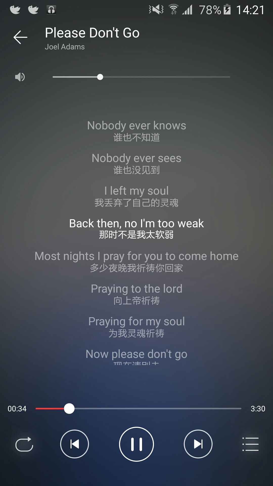
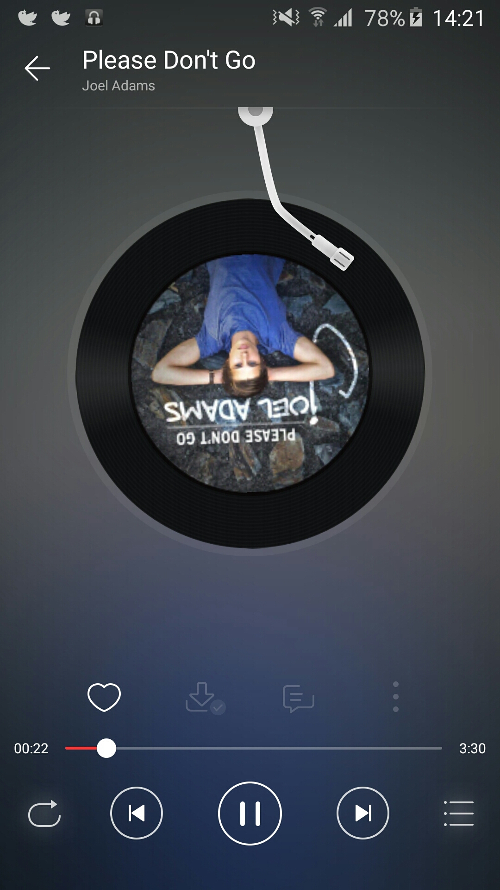
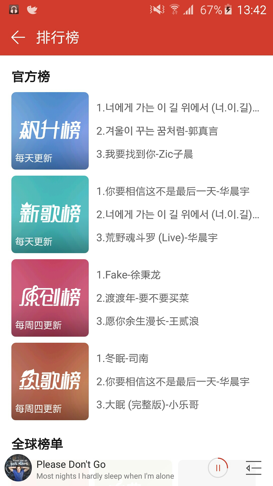
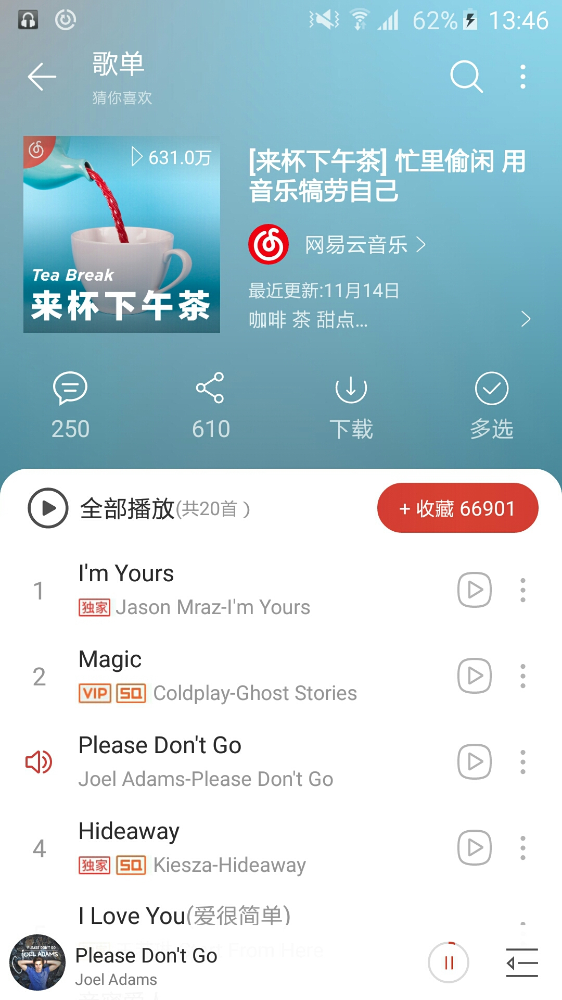
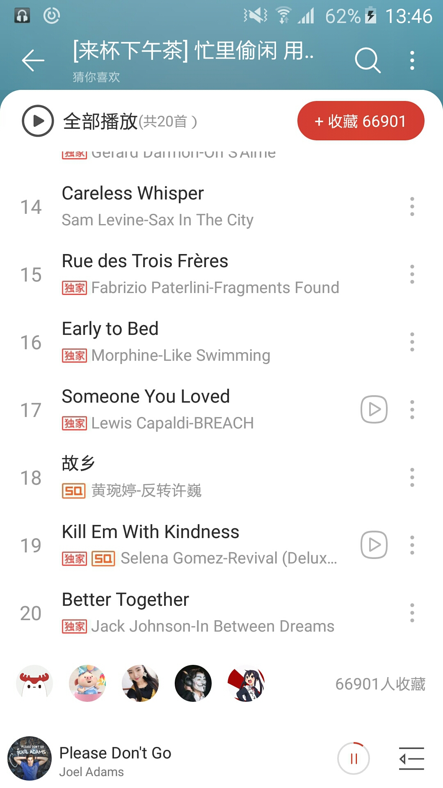
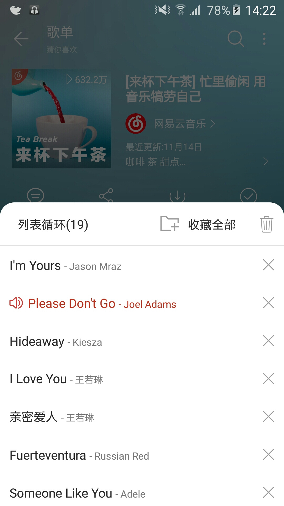
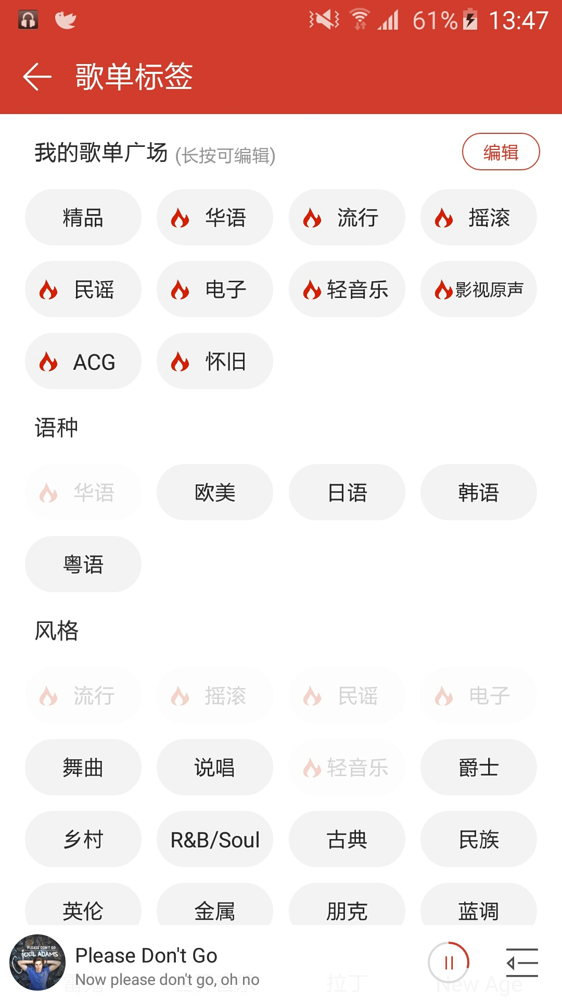

# XCloudMusic

仿网易云音乐，学习为目的。运行项目前需要先运行[NeteaseCloudMusicApi](https://github.com/Binaryify/NeteaseCloudMusicApi) 跑一个本地的服务器

**还有很多功能待完善，欢迎PR**

# Screenshots

# Library

- [AndroidAutoSize](https://github.com/JessYanCoding/AndroidAutoSize)
- [retrofit](https://github.com/square/retrofit)
- [logger](https://github.com/orhanobut/logger)
- [Glide](https://github.com/bumptech/glide)
- [More..](https://github.com/masterxing/XCloudMusic/blob/master/lib_opensource/build.gradle)

# Disclaimer
- XCloudMusic只用作个人学习研究，禁止用于商业及非法用途，如产生法律纠纷与本人无关
- 音乐api来自于[NeteaseCloudMusicApi](https://github.com/Binaryify/NeteaseCloudMusicApi)，非官方版api，本软件不提供任何音频存储服务，如需下载音频，请支持正版！。
- 音乐版权归网易云所有，本项目不承担任何法律责任和连带责任。如果已经涉及到您的版权，请速与本站管理员联系，我们将第一时间为你处理。
- XCloudMusic 并不是一个破解软件，不提供下载付费歌曲！
